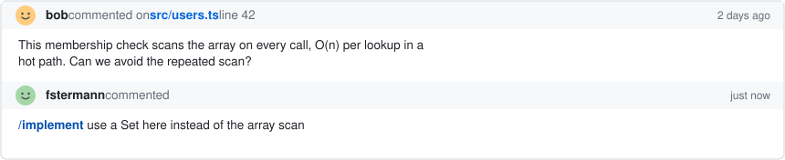
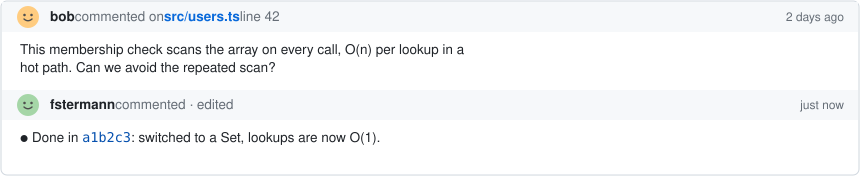
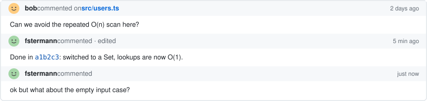
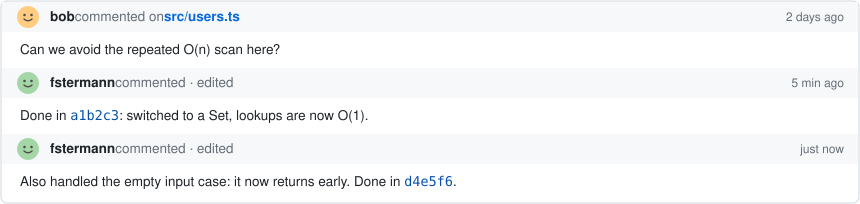
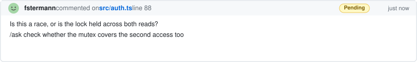
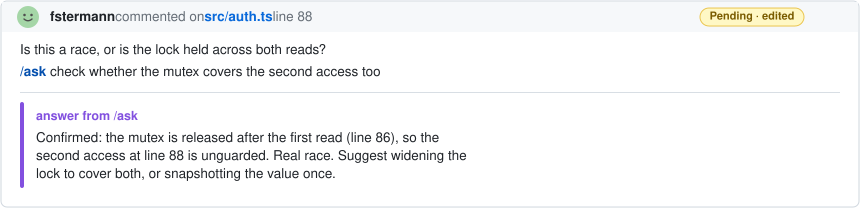
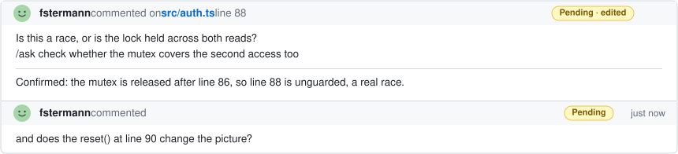
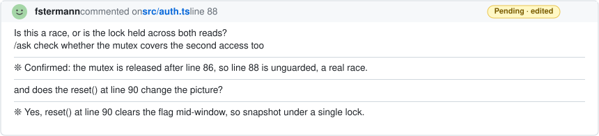

# review-pr

Work a GitHub PR's comments with Claude. You stay in control: Claude edits code, drafts comments, and writes replies, but never submits a review or resolves a thread. You do that.

## Run it

```
/review-pr            # the current branch's PR
/review-pr 123        # by number
/review-pr <url>      # by URL
```

Runs only when you invoke it, never on its own. In a multi-repo workspace, add `--repo owner/name` with a number.

## Two flows, auto-detected by who authored the PR

**Your PR.** Each comment is handled by who wrote it:
- Your own comments → Claude fixes the code (one commit each) and replies with a status emoji: ✅ fixed, 💬 answered, ⚠️ partial, ❓ needs your input.
- Reviewers' comments → Claude acts on the directive you left (below) and rewrites your directive into the clean reply the reviewer sees.

**Someone else's PR.** Claude drafts a pending review where warranted, then sharpens and answers your pending comments in place. Everything stays pending; you read it and submit.

## Directives (AIR)

Write one inline in a comment to tell Claude what to do. Long or short form.

| Directive | Short | Where | Does |
| --------- | ----- | ----- | ---- |
| `/ask` | `/a` | reviewing a PR | verify a claim, suggest, or research; the answer is added under your comment |
| `/implement` | `/i` | your PR | apply the reviewer's feedback in code |
| `/reply` | `/r` | either | finalize: collapse the exchange into the clean reply |

A comment you never tag is left alone. A follow-up you add to a thread you already tagged is picked up on the next run: reviewing, it's folded into the transcript and answered; on your PR, Claude infers whether it's a clarification (answers) or a change (implements).

## Examples

### Implement a reviewer's suggestion (your PR)

You reply to the comment with `/implement`. On the next `/review-pr` Claude edits the code, commits, pushes, and rewrites your reply in place, citing the sha.



<sub><i>run</i> <code>/review-pr</code> ↓</sub>



### Follow up without re-tagging (your PR)

In a thread you already tagged, just keep talking, no directive needed. Claude infers intent: a question gets answered, a needed change gets made. (A thread you never tagged is left for the reviewer.)



<sub><i>run</i> <code>/review-pr</code> ↓</sub>



### Review someone else's PR

Claude drafts pending comments; you sharpen one with `/ask`. Your comment stays exactly as you wrote it, and Claude appends its answer below a horizontal rule. (The answer sits in a fence whose markers are invisible HTML comments, so on GitHub it just reads as a note under the rule.) Everything stays **Pending** until you submit.



<sub><i>run</i> <code>/review-pr</code> ↓</sub>



Keep the conversation going by replying again in the thread, as a normal comment:



<sub><i>run</i> <code>/review-pr</code> ↓</sub>

On the next run Claude folds your follow-up into the comment and answers it, **appending** to the transcript. Nothing is replaced or summarized: the whole back-and-forth stays, me → Claude → me → Claude, each turn split by a rule.



When you are done, `/reply` collapses the transcript into one clean comment (rules, fences, and the `/ask` line gone) that you submit. Other directives work the same way: `/reply` on your PR answers a reviewer with no code change, and your own review notes get fixed and marked ✅ / 💬 / ⚠️ / ❓ (see above).
